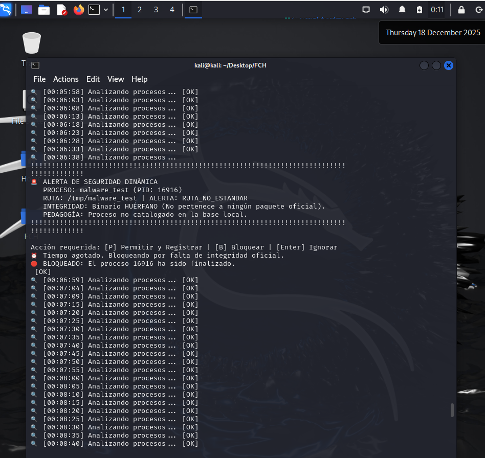

# **Linux Security & Integrity Suite (FCH) - v0.2.8 Premium**

## **🛡️ Propósito del Proyecto**

**FCH (Filesystem & Control Health)** es una suite de herramientas de ciberseguridad diseñada para el control total de la integridad en sistemas Linux. Ha evolucionado de una auditoría estática de archivos a un sistema híbrido que combina el análisis de disco con la **Vigilancia Inteligente de RAM**.

Esta suite ayuda a los administradores a identificar "zonas ciegas" y detectar malware persistente o volátil mediante la verificación cruzada de firmas oficiales del sistema.

## **🚀 Valor Añadido de la Suite**

A diferencia de los escáneres genéricos, la FCH Suite ofrece un enfoque de **Seguridad Pedagógica**:

* **Auditoría de Control Total (v0.1.2):** Escaneo de más de 2 millones de archivos con clasificación pedagógica de riesgos (BAJO, MEDIO, ALTO, CRÍTICO).

* **Vigilancia de RAM con Dpkg (v0.2.8):** Verificación en tiempo real de la integridad de los procesos comparando sus hashes con la base de datos oficial del sistema.

* **Auto-Aprendizaje Inteligente:** Gestión de una base de conocimiento en formato JSON que registra automáticamente procesos verificado de confianza.

* **Protocolo de Bloqueo (Fail-Safe):** Capacidad de finalizar automáticamente procesos sospechosos en rutas no estándar si no hay intervención del usuario.

* **Saneamiento Forense:** Limpieza de ruido de auditoría (FUSE/GVFS) para informes precisos y profesionales.

## **📁 Estructura del Proyecto**

* fch_v0_1.py: **Módulo Suite Principal**. Orquestador de la auditoría de archivos y lanzador del monitor RAM.  
* fch_dynamic_v0_2.py: **Monitor Dinámico de Procesos**. El "cerebro" que vigila la RAM y verifica hashes oficiales.  
* base_conocimiento.json: **Base de Inteligencia**. Almacena la pedagogía y procesos de confianza (se genera automáticamente).  
* fuse_clean_v0_1.sh: **Script de Saneamiento**. Limpia montajes virtuales para eliminar ruido en los informes.

## **🛠️ Requisitos e Instalación**

* **SO:** Linux (Debian, Ubuntu, Kali Linux).  
* **Dependencias:** Python 3.x, python3-psutil.  
* **Privilegios:** Ejecución obligatoria con sudo.

```Bash

# Clonar y preparar  
$ git clone https://github.com/tu-usuario/fch-security-suite.git  
$ cd fch-security-suite  
$ chmod +x fuse_clean_v0_1.sh

```

## **📖 Guía de Uso**

### **1. Iniciar la Auditoría Completa**

Ejecute el script base para un escaneo total del sistema:

```Bash

# Ejecutar
$ sudo python3 fch_v0_1.py

```

### **2. Flujo de Trabajo (Workflow)**

1. **Consentimiento:** Aceptación de términos legales y de responsabilidad.  
2. **Saneamiento FUSE:** Limpieza interactiva de puntos de montaje de usuario.  
3. **Escaneo de Disco:** Clasificación pedagógica de errores de acceso.  
4. **Veredicto Ejecutivo:** Resumen de salud del sistema de archivos.  
5. **Vigilancia RAM:** Transición opcional al monitor dinámico con auto-aprendizaje.

## 🧪 Prueba de Concepto (PoC) en Kali Linux

La suite ha sido sometida a pruebas de estrés en entornos de seguridad, demostrando su capacidad para detectar y neutralizar "falso malware" ejecutado desde rutas críticas como /tmp/.



En la imagen superior se observa cómo el sistema identifica un binario huérfano en una ruta no estándar y procede a su bloqueo automático tras expirar el tiempo de respuesta, garantizando la integridad del Host.

## **📊 Análisis de la Salida (Reports)**

La suite genera informes técnicos detallados:

* **auditoria_control_*.csv:** Detalla rutas inaccesibles, nivel de riesgo y recomendación de mitigación.  
* **incidencias_ram_*.csv:** Registra bloqueos de procesos sospechosos o autorizaciones de usuario.

## 🚀 Roadmap / Próximas Mejoras

* **Integración con Telegram:** Notificaciones de alertas críticas directas al móvil.

* **Soporte Multi-Distribución:** Extensión del motor de hashes para sistemas basados en RPM (Fedora/RHEL).

* **Módulo de Cuarentena:** Aislamiento físico de binarios sospechosos antes de su ejecución.

* **Dashboard Gráfico (GUI):** Panel visual desarrollado en Python para monitorización centralizada.

## **👨‍💻 Perfil del Proyecto**

Desarrollado como una herramienta educativa y profesional para la gestión de integridad. Este proyecto demuestra la capacidad de integrar lógica de bajo nivel de Linux con estructuras de datos dinámicas (JSON) para la toma de decisiones en ciberseguridad.
